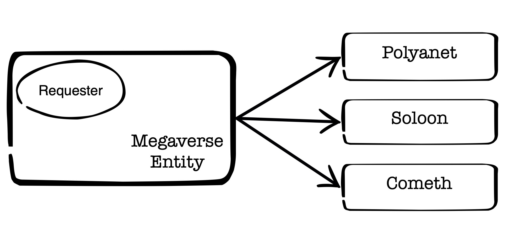

# Create Megaverse

`create-megaverse.rb` is a Ruby script designed to facilitate the creation of a megaverse by downloading a Goal Map from a specified source. It includes options for debugging and customizing the source of the Goal Map.

## Usage

To see the available options, run:

```bash
./create-megaverse.rb --help
```

### Command-Line Options

```plaintext
Usage: create-megaverse.rb [options]

    -f, --from-source                Download Goal Map from source
    -d, --debug                      Enable debug mode
```

### Options

- `-f`, `--from-source`:
  Downloads the Goal Map from the specified source. This option is essential for initiating the creation process.

- `-d`, `--debug`:
  Enables debug mode, providing additional output to assist in troubleshooting issues during execution.

## Configuration

This script uses the following configurable parameters, located in `config.rb` file:
- `CANDIDATE_ID`:
  Specifies the candidate id that the requests will be for.

- `RATE_LIMIT_DELAY_SECS`:
  Specifies the delay (in seconds) between requests to avoid hitting rate limits. Default value is `2` seconds.

- `MAX_RETRIES`:
  Defines the maximum number of retry attempts for sending creation requests in case of failure. Default value is `5`.

- `POLYANET_URL` :
  URL to create Polyanets

- `SOLOON_URL` :
  URL to create Sollons

- `COMETH_URL` :
  URL to create Comeths

- `GOAL_URL`:
  URL to get the requested Goal Map

- `GOAL_FILENAME` :
  Filename that the Goal Map will be stored locally

These parameters can be adjusted in the configuration section of the script as needed to fit your requirements.

## Installation

Ensure you have Ruby installed on your system. You can check your Ruby version by running:

```bash
$ ruby -v
ruby 3.2.1
```

To run this script, simply clone or download the repository, navigate to the directory containing `create-megaverse.rb`, and make it executable:

```bash
$ chmod +x create-megaverse.rb
```

## Examples

1. Create the Megaverse downloading the Goal Map from the default source:

    ```bash
    ./create-megaverse.rb -f
    ```
2. Create the Megaverse rertiving the Goal Map from the local file configured in GOAL_FILENAME var:

    ```bash
    ./create-megaverse.rb
    ```
3. To enable debug mode:

    ```bash
    ./create-megaverse.rb -d
    ```

## Running Tests

This project uses RSpec for testing. To run the tests, follow these steps:

1. Make sure RSpec is included in your `Gemfile`:
   ```ruby
   group :development, :test do
     gem 'rspec'
   end
   ```

2. Install the required gems:
   ```bash
   bundle install
   ```

3. Run the tests using RSpec:
   ```bash
   bundle exec rspec
   ```

## Architecture


Megaverse is created by 3 different object classes Polyanets, Soloons and Comeths,
all are based on the Megaverse Entity that sends the respective creation requests to the destinations.

Requester Module is used from Megaverse Entity to handle the HTTP communication.

## License

This project is licensed under the MIT License. See the LICENSE file for details.

## Contributing

Contributions are welcome! Please submit a pull request or open an issue for any enhancements or bug reports.

